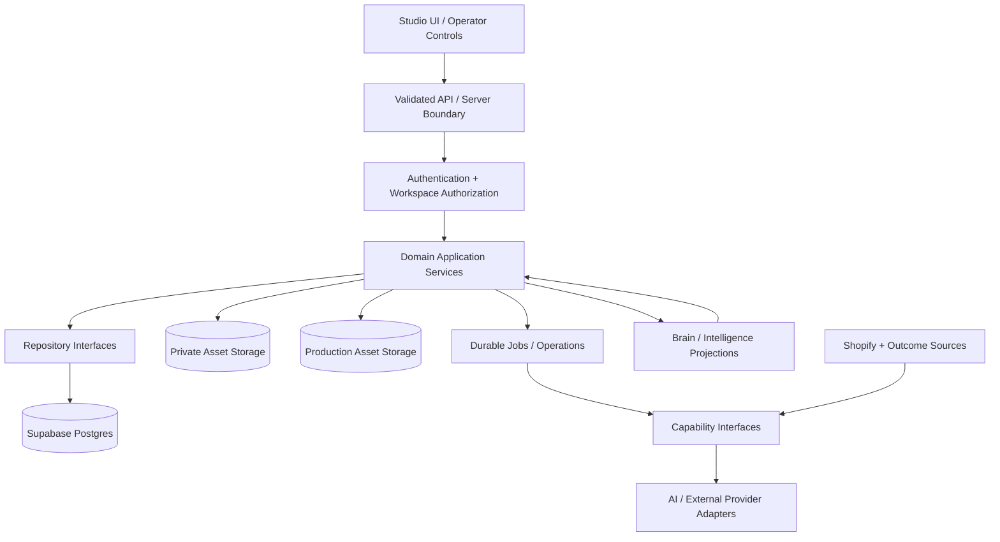

# NexHQ Architecture

Status: Canonical Architecture Specification  
Applies to: Entire NexHQ repository  
Current primary workspace: Milaene  
Last verified against code: 2026-08-16

## 1. Status Header

This document defines both the verified **CURRENT architecture** and the binding **TARGET architecture** for NexHQ. It is the canonical reference for system boundaries, domain ownership, persistence, storage, APIs, repositories, providers, jobs, workspace isolation, and cross-studio contracts.

Status labels have the meanings defined in `docs/nexhq/03_DEVELOPMENT_RULES.md`:

- **IMPLEMENTED** — a meaningful code path exists; runtime operation is not implied.
- **PARTIAL** — useful architecture exists, but the complete product or production contract is not satisfied.
- **PLACEHOLDER** — a shell, type, route, or adapter exists without a working integration.
- **PLANNED** — target architecture is not implemented in the inspected repository.
- **DEPRECATED** — compatibility behavior that must not define new architecture.

Current-state statements are based on repository inspection plus the explicitly documented database checks. The 2026-08-17 Image mission added Design artwork, ProductProductionContext, Image project/job/asset boundaries and tests; final suite/build counts are recorded in the mission report rather than frozen here. Persona Foundation remains applied. The two Image/Design authority migrations were applied on 2026-08-17 and live schema/RLS/grants/buckets were verified. No paid provider, image/video generation, data reset, deployment, or full E2E production workflow was run.

## 2. Architectural Goals

NexHQ should operate as a modular AI-powered business operating system, not as a collection of isolated studios or provider demos.

The architecture MUST support:

- durable business state that survives refresh, restart, and redeployment;
- one explicit authority for each business concept;
- studio-specific domain ownership;
- reusable, versioned, traceable assets;
- explicit cross-studio contracts;
- replaceable AI and external-data providers;
- explicit human control for identity, approval, cost, publishing, and destructive actions;
- safe paid operations with durable traceability;
- normalized real external data with provenance;
- testable workflows and failure recovery;
- authenticated, authorized, future multi-workspace operation;
- clear separation between business truth, intelligence, provider execution, and UI state.

The primary target production flow is:

```text
Business / Brand Context
        ↓
Persona Studio ───────────────→ Approved Brand Models

User-created artwork
        ↓
Design Studio ────────────────→ Approved Master Artwork

Shopify ──────────────────────→ Product / Variant Truth

Approved Brand Models
+ Approved Master Artwork
+ Product / Variant Truth
+ Campaign Direction
        ↓
Image Studio ────────────────→ Campaign / Product / Social / Shop Assets
        ↓
Video Studio ────────────────→ Video Assets using the same approved context

Real outcome data
        ↓
Performance Intelligence ────→ Evidence-backed recommendations across studios
```

Studios consume durable truth from upstream authorities. They do not recreate or silently reinterpret it.

## 3. Current Repository Topology

### Runtime and framework

**CURRENT STATE:** NexHQ is a modular monolith implemented as a Next.js 15 App Router application with React 19 and TypeScript. It uses route handlers for server APIs, a mixture of server and client components, Supabase for primary database/storage persistence, direct external integrations, AI agent modules, and domain-oriented libraries (`package.json`, `app/`, `components/`, `agents/`, `brain/`, `lib/`).

### Primary repository areas

| Area | Current responsibility | Architectural status |
|---|---|---|
| `app/(dashboard)/` | Dashboard pages, studio entry routes, Facility, reports, tasks, projects, and settings. | **IMPLEMENTED/PARTIAL** |
| `app/api/` | Next.js route handlers for studios, agents, reports, tasks, Brain utilities, Facility, Shopify, and Research data sources. All application APIs now require a validated Supabase session at middleware; Persona routes additionally share one actor/allowlist/workspace guard. Domain workspace authorization and service layering remain inconsistent outside Persona. | **IMPLEMENTED/PARTIAL** |
| `components/` | Studio workspaces and presentation/controller components. Several studio components own substantial workflow state. | **IMPLEMENTED/PARTIAL** |
| `agents/` | Specialist agent orchestration: retrieve context → call model/provider → parse/validate → save a Brain report. Also contains image-generation providers and Design generation functions. | **IMPLEMENTED**, provider abstraction varies |
| `brain/` | Typed generic memory, report, task, workspace, context assembly, seed, event, and Supabase client architecture. | **IMPLEMENTED/PARTIAL** |
| `lib/persona/` | Persona domain, repositories, creation lifecycle, paid jobs, novelty, Reference Package, Identity Lock, approvals, storage, and services. | **PARTIAL**, strongest domain/repository architecture |
| `lib/design/` | Design intelligence, client mission state, Master Artwork models, artwork generation/validation, and production helpers. | **PARTIAL**, largely client/browser-owned operational state |
| `lib/image/` | Design handoff store, Image workspace helpers, production queue orchestration, and Master Artwork prompt preparation. | **PARTIAL**, includes browser/process-local state |
| `lib/shopify/` | Shopify Admin API client, live catalog/knowledge, product detail, commerce history, operations, and performance derivation. | **IMPLEMENTED/PARTIAL** |
| `lib/product-intelligence/` | Product domain model, Milaene seed catalog, precedence rules, and Shopify provider boundary. | **PARTIAL**, synchronous path is seed-only |
| `lib/data-source-platform/` | Data-source adapter registry, auth/config state, sync orchestration, health, and process-local cache. | **PARTIAL** |
| `lib/research-intelligence/` | Provider normalization, signal taxonomy, fusion, confidence, reasoning, reports, and creative-research flows. | **IMPLEMENTED/PARTIAL** |
| `lib/tasks/`, `lib/reports/`, `lib/orchestration/` | Brain-backed tasks/reports, human review, agent execution, and task/report synchronization. | **IMPLEMENTED/PARTIAL** |
| `services/` | Older/parallel research and connector service modules. | **LEGACY/PARTIAL**, overlaps newer `lib/` architecture |
| `supabase/migrations/` | Brain, image storage, Persona lifecycle, jobs, novelty, Reference Package, Identity Lock, and approval schema. | **IMPLEMENTED IN REPOSITORY**; Persona Foundation migrations applied and verified, broader history/runtime state varies by domain |
| `brain/workspaces/` | Static workspace registry for Milaene, Nex Trends, and Nex Agency plus seed definitions. | **IMPLEMENTED**, runtime selection is environment-based |
| `reports/`, `tasks/` | Shared report/task types and static artifacts. | **IMPLEMENTED/PARTIAL** |

### Current studio entrypoints

- Persona: `app/(dashboard)/agents/persona/page.tsx` → `components/persona/persona-studio.tsx`
- Design: `app/(dashboard)/agents/design/page.tsx` → `components/design/design-studio-center.tsx`
- Image: `app/(dashboard)/agents/image/page.tsx` → `components/image/image-studio-center.tsx`
- Video: `app/(dashboard)/agents/video/page.tsx` → placeholder page
- Shopify: `app/(dashboard)/agents/shopify/page.tsx` → `components/shopify/shopify-operations-center.tsx`
- Research: `app/(dashboard)/agents/research/page.tsx` → `components/research/v3/`

### Current architectural style

The repository is best described as a **domain-oriented modular monolith with a shared Brain and Supabase backend, but hybrid and fragmented state ownership**. Persona follows a recognizable route → service → repository → Supabase pattern. Brain-backed agents follow retrieve → provider → validate → save-report. Design and Image place more workflow responsibility in large client modules, Brain report JSON, browser storage, and module globals. Shopify, Product Intelligence, Research data sources, and business context expose multiple parallel representations of related truth.

## 4. Target System Topology

The target remains a modular monolith unless operational evidence justifies another deployment shape. Logical boundaries matter before service extraction.



The required request path is:

> UI → validated server boundary → authenticated actor/workspace scope → domain application service → repository or capability interface → durable state/provider

Target rules:

- UI components render and collect intent; they are not business authorities.
- Route handlers validate, authorize, and delegate; they should not contain the only business rule.
- Application services own use cases and state transitions.
- Domain models own invariants and eligibility.
- Repositories own persistence translation and workspace-scoped access.
- Provider adapters own vendor-specific APIs.
- Durable jobs own expensive or resumable execution.
- Brain/intelligence consumes authoritative records and provides context, reports, recommendations, and projections without replacing domain truth.
- Cross-studio consumers receive versioned contracts, not permission to write another domain's governed fields.

## 5. Domain Ownership Map

| Domain | Target owner | Owned truth | Must not own |
|---|---|---|---|
| Workspace / Brand Context | Platform workspace and brand-context domain | Workspace identity, brand configuration, brand rules, approved operating context | Persona identity, catalog inventory, production assets |
| Persona / Brand Model | Persona Studio | Candidates, Persona identity, Master Identity Reference, Reference Package, Identity Lock, use eligibility, Brand Cast membership | Campaign composition, artwork, product catalog |
| Master Artwork | Design Studio | Approved artwork versions, metadata, rights/provenance, production readiness, handoff | Persona identity, product availability, campaign-generated assets |
| Product / Catalog | Shopify integration when connected and authoritative | Products, variants, colors, sizes, collections, availability, active/sellable status | Master Artwork, Persona eligibility, generated campaign state |
| Image Production | Image Studio | Campaign/image projects, shot/asset plans, generated images, image review/approval, image-production state | Persistent Persona or product authority |
| Video Production | Video Studio | Video projects/jobs, generated videos, video review/approval, video-specific execution | Persistent Persona or product authority |
| Research Intelligence | Research Studio | Research requests, normalized research evidence, confidence, creative/market recommendations | Measured outcome truth or governed production truth |
| Performance Intelligence | Performance Intelligence domain | Normalized outcome signals, attribution/provenance, derived learning | Uploaded assets as performance evidence, catalog authority |
| Tasks / Reports / Decisions / Context | Brain and orchestration domains | Generic tasks, agent reports, review records, decisions, contextual projections, audit-support events | Silent copies that supersede Persona, artwork, catalog, or outcome authorities |
| Provider Execution | Capability/provider layer | Vendor request/response normalization, cost/usage metadata, provider health | Product decisions, approvals, domain ownership |

No downstream studio may update upstream governed truth except through the owning domain's explicit command/API.

## 6. Source-of-Truth Map

| Business concept | CURRENT authority/state | Current conflict | TARGET authority |
|---|---|---|---|
| Workspace identity | Environment-selected slug plus static registry; Brain persists/creates `brain_workspaces`. | Registry identity, Brain row, and local fallback can diverge; user membership is not established. | Persisted workspace with authenticated membership; registry only for bootstrap/configuration. |
| Brand/business context | Static `lib/business/`, `lib/brand-memory/`, MarketPrint registries, Brain seed records, and live Shopify enrichment. | Multiple representations and Milaene fallbacks; workspace ID parameters are sometimes ignored in favor of active slug. | One approved workspace/brand context model with explicit projections for agents and UI. |
| Persona identity | Supabase-backed Persona, review-bound Identity Lock snapshots, explicit approvals, and Brand Cast state are the canonical application/domain authority. The process-global Official Brand Face store remains temporary compatibility/session state only. Protected routes share an application authorization/workspace context. Both Foundation migrations are applied and live RLS/grants are verified. A first-class owner reconciliation command recorded a present-tense review and created immutable lock version 3 without rewriting historical version 2. Exact locked-package reference rights are now part of canonical eligibility, with an owner-only audited confirmation command. | The owner reports the reconciled lock-v3 Persona rights-confirmed and selectable by Image. The production allowlist is not durable membership/RBAC; general Identity Revision is absent; Image live paid execution remains default-closed pending application of the new durable job migration and controlled live verification; and Video remains a typed boundary rather than an operational studio. | Supabase-backed Persona/Identity Lock/approval/Brand Cast authority only. |
| Master Artwork | Protected Design approval now creates immutable ID/version/checksum/provenance and private storage; browser handoff is transport only. Migration applied 2026-08-17. | Live browser-to-approval E2E unverified; general approval history/revision UX remains narrow. | Durable, versioned Design-owned Master Artwork record plus durable asset objects and approval history. |
| Product catalog | Image has one typed context: live Shopify IDs are re-resolved server-side; Design/seed/Brain/unknown remain non-authoritative. Product Intelligence remains separately seed-first. | The Image seam is authoritative when live-selected, but the platform still has parallel representations and no universal durable catalog projection. | Shopify-backed catalog boundary is authoritative when connected; labeled seed/manual fallback otherwise. |
| Image project/asset state | Versioned `image_production_projects`, exact-input jobs, private `image_production_assets`, signed access, and human review are implemented; Brain remains a plan/report projection and local state remains for presentation. Migrations applied 2026-08-17. | Live provider/E2E unverified; some UI presentation/queue state is still client/module-local. | Image-owned durable campaign/project, asset, approval, and job records; Brain consumes projections. |
| Video state | Placeholder route and placeholder Persona hook. | No production authority exists. | Video-owned durable project, asset, job, and approval records. |
| Tasks and agent reports | Brain `brain_records` with typed JSON content and statuses. | Service-role access and multi-step event/task sync are not fully transactional. | Brain remains authority for its explicit task/report/decision domains with workspace authorization. |
| Research provider data | Adapter results and process-local TTL cache; reports may be saved to Brain; simulated/live modes are modeled. | Sync history and cache are not durable; some older `services/` connectors overlap. | Durable source/sync metadata and normalized evidence with provenance; Brain/report projections as consumers. |
| Performance outcomes | Shopify catalog/order computations, CSV import support, and derived performance objects. | No unified durable asset/product/campaign outcome model or complete cross-channel learning loop. | Performance Intelligence normalized signal store linked to source, asset, product, campaign, time window, and attribution. |

Mocks, fixtures, seeds, local state, process caches, and inferred values are never business authority.

## 7. Studio Boundaries

### Persona Studio — identity authority

Owns the full governed Brand Model lifecycle and use eligibility. It publishes read-only versioned identity packages for downstream consumers. It does not own campaigns, Master Artwork, or products.

### Design Studio — artwork authority

Owns user-created/approved Master Artwork, its versions, production metadata, provenance, validation, and handoff. It does not own final Persona identity, Shopify inventory, or generated campaign assets.

### Image Studio — image-production authority

Owns durable image campaign/project composition and generated image assets. It references upstream IDs and versions; it does not copy and redefine Persona, artwork, or product truth.

### Video Studio — video-production authority

Owns video-specific projects, jobs, assets, and review. It consumes the same approved identity/product/design context and adds video-use enforcement.

### Shopify Studio / integration — commerce boundary

Owns external Shopify communication and the normalized active catalog contract when Shopify is connected and authoritative. It may publish approved NexHQ production assets to Shopify through explicit commands; it does not own how Persona or Design approval is established.

### Research Studio — research and creative intelligence

Owns research evidence, provider normalization, analysis, confidence, and recommendations. It informs other domains without declaring production approval or measured performance.

### Performance Intelligence — outcome-derived intelligence

Owns normalized real outcome signals and learning derived from those signals. It must preserve provenance and attribution limitations.

### Brain — cross-cutting memory and coordination

Owns generic Brain records explicitly declared as Brain domains, including tasks, reports, decisions, context projections, and supporting events. It augments studio domains; it must not silently become a generic replacement for every domain model.

## 8. Persistence Architecture

### Current persistence

**CURRENT STATE:** Supabase is the primary durable persistence layer in repository code.

| Persistence area | Current mechanism |
|---|---|
| Brain/workspaces/tasks/reports/context records | `brain_workspaces`, `brain_records`, `brain_events`; `brain_embeddings` exists structurally but semantic/vector operation is deferred. |
| Persona core/libraries | Dedicated `persona_*` tables through `PersonaRepository`. |
| Persona casting/review | Creation projects, candidates, assets, identity reviews, discovery attempts, novelty records, and milestone tables. |
| Persona paid work | Durable generation jobs and confirmations for Discovery; Reference Package sessions/attempts use separate tables. |
| Persona identity | Reference assets, immutable lock snapshots, approval fields, and private storage references. |
| Image plans/assets | Image plan and generation status embedded in Brain report JSON; generated files in Supabase Storage. |
| Design mission/Master Artwork | Browser `localStorage`, component state, data URLs/object URLs; not durable server authority. |
| Design→Image handoff | `localStorage`, `sessionStorage`, and `window.name`. |
| Data-source cache | Process-local `Map`. |
| Official Brand Face registry | Process-global object. |
| Product Intelligence fallback | Static TypeScript seed registry. |

Migration files prove repository intent only. They do not prove live schema or data.

### Target persistence rules

- Persistent domain records belong in the database owned by their domain.
- Private identity/reference metadata belongs in Persona tables; object bytes belong in controlled private storage.
- Master Artwork metadata, version, approval, rights, and storage references belong in a durable Design-owned aggregate.
- Image/Video campaigns, assets, reviews, and jobs belong in their own durable production records rather than generic browser state.
- External catalog data should be normalized through the Shopify boundary and may be cached/snapshotted with source and freshness.
- Performance signals require a durable normalized store with immutable source provenance.
- Brain should store reports, tasks, decisions, and domain projections/references—not uncontrolled copies of authoritative aggregates.
- Browser state is limited to unsaved form state, view preferences, optimistic display state, and explicitly disposable drafts.
- Production repository factories must fail closed when durable storage is unavailable; memory implementations are for tests or explicitly non-authoritative previews.

## 9. Storage Architecture

### Current storage

**Persona assets — IMPLEMENTED IN CODE:**

- private bucket `persona-references`;
- workspace/persona or creation-project scoped paths;
- short-lived signed URLs;
- checksums and reference metadata;
- Master/canonical asset protection in services;
- runtime bucket creation/verification through the admin client.

**Image assets — IMPLEMENTED IN CODE:**

- public bucket `image-assets`;
- path `{workspaceId}/{reportId}/{assetKey}.png`;
- service-role upload with `upsert`;
- public URLs stored in Brain image-section state;
- runtime bucket creation if the migration was not applied.

**Design assets — PARTIAL/LOCAL:**

- generated render/mockup/artwork routes return base64 data URLs or SVG data URLs;
- uploaded artwork is held as browser `File`/object URL state;
- mission sanitization attempts to fit selected URLs/SVG into `localStorage`;
- no inspected Design-owned durable object-storage repository exists.

### Target storage classes

1. **Private identity and sensitive references:** private bucket, short-lived authorized access, workspace scope, retention, checksum, immutable/versioned references.
2. **Approved Master Artwork and production source files:** durable storage with stable object identity, version, MIME/dimensions/checksum, rights/provenance, and immutable approval reference.
3. **Generated production assets:** durable storage with explicit visibility policy, immutable lineage, provider/job reference, and review state. Public delivery should be deliberate, not the default consequence of generation.
4. **Temporary processing artifacts:** bounded retention and no business-authority semantics.

Database rows should reference storage objects; data URLs and signed URLs must not be long-term identity. Storage writes and metadata writes need idempotency and reconciliation.

## 10. API / Server Architecture

### Current API architecture

The repository uses Next.js route handlers under `app/api/`. Common patterns include:

- UI `fetch` to a route handler;
- Zod validation in many, but not all, routes;
- environment/config checks;
- active workspace resolution through `ensureWorkspaceBrainSeeded()` or Persona scope helpers;
- direct call into an agent, service, or integration utility;
- JSON response and route-local error mapping.

The owner-auth foundation now places all application APIs behind a validated Supabase session at middleware: unauthenticated API calls receive JSON `401`, while `/login` and required static assets remain public. Persona routes then apply their stronger domain boundary. Every inspected route that exposes durable Persona identity/approval state uses `requirePersonaScope()`; the shared Persona boundary returns `403` for authenticated users outside its UID allowlist/workspace authorization. Task/report routes delegate to service modules. Many Design, Image, Research, Shopify, and Facility routes still directly orchestrate agent/integration functions, and API response/service layering remains non-uniform.

No inspected browser component receives the service-role key directly. Many server operations use the singleton service-role admin client. General authentication now rejects anonymous calls before those route handlers run, but only Persona establishes additional workspace authorization before privileged work; other route families still lack durable membership/role checks.

### Target server boundary

```text
Client intent
  → runtime validation
  → authenticated actor
  → workspace membership and object scope
  → domain command/query service
  → repository/capability
  → durable state or provider
  → structured result/error
```

Rules:

- Route handlers remain thin boundaries.
- UI validation is never the only validation.
- Governed state cannot be mutated through generic CRUD.
- Paid provider work cannot be a hidden side effect of a read, page load, or unrelated command.
- Cross-studio APIs return explicit versioned contracts rather than internal database shapes.
- Commands and queries must enforce workspace/object scope server-side.
- Long-running work returns durable operation/job identity rather than relying on one HTTP request remaining alive.
- Errors use consistent categories, correlation/operation identity, and safe details.

## 11. Repository / Service Pattern

### Current patterns

**Persona:** strongest repository architecture. Interfaces separate Persona/library, creation, generation jobs, Reference Package, Identity Lock, novelty, and discovery attempts. Supabase and memory implementations exist. The primary Persona and creation factories fail closed without Supabase, while several secondary factories can fall back to singleton memory repositories.

**Brain:** one `SupabaseBrainClient` owns generic Brain CRUD/search/event operations. Tasks, reports, orchestration, and agent save modules call it. Domain content is typed but persisted as JSONB.

**Agents:** specialist modules commonly implement retrieve context → direct OpenAI call → parse/normalize → save pending Brain report. The pattern is coherent, but provider and job concerns are often embedded in the agent function.

**Design/Image:** much orchestration resides in large client workspaces and function modules rather than durable application services/repositories. Design mission and Image approval state are client-owned. Image generation updates Brain JSON directly through agent functions.

**Shopify/Data Sources:** integration utilities and adapter registries exist, but there is no single product repository used by all consumers. Data-source adapters normalize provider status, while a process-local cache owns freshness within one process.

### Target pattern

Each governed domain SHOULD expose:

1. domain types, invariants, and state transitions;
2. command/query application services;
3. repository interfaces defined by the domain;
4. persistence adapters isolated from domain logic;
5. capability/provider interfaces for external work;
6. typed cross-studio contract builders;
7. tests for state, authorization, persistence, and contracts.

Repository methods must require workspace scope and should return domain models or explicit read models, not unvalidated provider/database rows. UI and provider adapters must not bypass application services to mutate governed state.

## 12. Provider Architecture

Providers are infrastructure, not product domains.

### Current provider architecture

- Persona Discovery has a strong `BrandFaceDiscoveryProvider` abstraction with OpenAI, FAL/FLUX, manual/disabled, and fake implementations.
- Persona Reference Package generation directly uses an OpenAI image-edit path and is not provider-neutral.
- Image generation has an `ImageProvider` interface and OpenAI/Flux registry, although comments and prompt-only legacy types are stale relative to live generation code.
- General Research/Design/Image/Marketing/Shopify/Content agents call the shared OpenAI client directly and hard-code model behavior inside agent modules.
- Shopify uses a dedicated Admin GraphQL client and domain mapping utilities.
- Research data sources use a `DataProviderAdapter` registry with auth, health, live/simulated mode, rate-limit metadata, and normalized sync results.
- Research Intelligence adds a provider-normalization boundary and provider-neutral signal taxonomy.

### Target capability layer

Domain/application code should depend on capabilities such as:

- Persona Discovery;
- Reference Expansion;
- Image Generation or Image Edit;
- Video Generation;
- LLM Planning/Structured Completion;
- Catalog Read/Sync;
- Outcome Signal Read/Sync.

Adapters implement those capabilities and normalize requests, results, errors, usage, cost, health, cancellation, and provenance. Provider SDK types and model-specific behavior must remain at the edge. Provider selection/fallback must be explicit and cannot alter domain rules. Every stored generated asset/report should retain provider, model, request/job identity, settings needed for audit, and cost/usage where available.

## 13. Persona Identity Architecture

### Current architecture

Persona Studio has one canonical application/domain identity architecture: the Supabase-backed Persona lifecycle under `lib/persona/`. An Official Brand Face selection/registry model remains under `lib/brand-face-selection/` in a process-global object, but it is explicitly temporary, non-authoritative compatibility/session state and no longer decides production UI membership or eligibility.

The durable lifecycle includes creation projects, discovery attempts, candidates, candidate assets, human selection, Draft Persona conversion, Master Identity Reference, five-angle Reference Package, local face evidence, manual review, review-bound Identity Lock snapshots, separate image/video/Brand Cast approvals, and centralized eligibility queries. Generic Persona CRUD rejects approval, readiness, and lock fields; legacy `Approved` status does not grant membership or eligibility.

`LockedBrandIdentity` models the immutable lock aggregate. One Zod-validated `brand-model-v1` contract projects workspace, stable Persona/Brand Model identity, exact snapshot ID/version/fingerprint, review/provenance, Reference Package identity, downstream-safe reference identifiers, constraints, explicit approvals, independent eligibility, and safe failure reasons. The canonical contract contains neither storage paths nor signed URLs. `buildImageStudioPersonaHandoff` and `buildVideoStudioPersonaHandoff` enforce the centralized Persona eligibility result, reject stale expected versions, and may add short-lived signed asset access as a transient envelope. `/api/persona/integrations` protects list/full reads with the Milestone 2 actor/workspace boundary.

The application/domain authority bypasses identified before Milestone 1 are closed. Milestone 2 adds one typed authorization/workspace boundary for protected Persona APIs, cross-workspace checks around governed operations/contracts, a fail-closed legacy lock diagnostic, and a deny-direct-access RLS migration. Milestone 3 adds real Image/Video handoff boundaries without creating another identity authority. Both Foundation migrations are now applied and the live schema/RLS/grant posture is verified. The legacy recovery seam is now first-class: it records an explicitly labeled current reconciliation review inside the durable review record, requires exact Master/5-of-5 package equivalence with the historical snapshot, creates version `N+1`, preserves version `N`, and never grants Video approval. The owner completed that identity reconciliation, producing lock version 3 while preserving version 2. A subsequent read-only diagnostic found explicit rights missing only on the locked Master reference; the owner then completed the protected audited rights confirmation manually and reports the lock-v3 Image selector handoff working. Generation now revalidates the exact lock/package and current rights, resolves private Master bytes transiently, and supplies them to the OpenAI edit adapter. Remaining weaknesses include an environment allowlist instead of durable workspace membership/RBAC, memory fallback in secondary repositories, missing general Identity Revision, the unapplied Image paid-job migration, and incomplete live-provider/E2E verification.

### Target architecture

- The Supabase-backed Persona aggregate, immutable Identity Lock snapshots, explicit approvals, and roster membership become the only persistent identity authority.
- Official Brand Face registry state must migrate into or become a projection of that authority.
- Governed lock/approval fields are command-only and cannot be changed through generic update APIs.
- An identity revision creates a new lock version and preserves all prior snapshots.
- Persona publishes separate Image-eligible and Video-eligible contracts.
- Downstream assets persist Persona ID, lock version, fingerprint, and relevant reference provenance used at generation time.
- Every consumer fails closed on stale, archived, missing, revoked, unresolved, or ineligible identity.

The detailed lifecycle and invariants remain governed by `docs/nexhq/studios/PERSONA_STUDIO.md`.

## 14. Design Asset Architecture

### Current architecture

- Research reports can be transformed into typed Design Studio briefs through Brain-backed APIs and handoff transformers.
- Design Agent collection concepts are saved as pending-review Brain reports.
- The interactive Design mission is a large client-side aggregate persisted to `localStorage`.
- `MasterArtworkState` models draft/review/approved status, source type, versions, URLs/SVG, print metadata, scores, and approval time.
- User-upload V2 artwork uses browser File/object URLs and local analysis state.
- Generated render/mockup/Master Artwork paths return data URLs or SVG-derived previews rather than durable Design storage objects.
- Approval is applied in client state, and Design→Image handoff is serialized to browser storage.
- Autonomous AI Designer and Master Artwork generation routes exist, conflicting with the target user-owned final artwork workflow.

The TypeScript model calls Master Artwork the Design source of truth, but no durable server-side approved Master Artwork authority was found. It is therefore a **PARTIAL local contract**, not production truth.

### Target architecture

Design Studio owns a durable Master Artwork aggregate with:

- stable workspace and artwork identity;
- immutable/versioned production file references;
- source type and human ownership;
- checksum, MIME, dimensions, DPI, transparency, print method, and placement;
- rights/provenance;
- validation results and warnings;
- explicit approval/revision/retirement history;
- actor and timestamps;
- a versioned handoff read model.

AI may generate concepts or preparation artifacts, but only a deliberate human action promotes a specific file/version to approved Master Artwork. Brain Design reports may reference or summarize it; they must not be a competing artwork record.

## 15. Product / Shopify Architecture

### Current architecture

There are several product/catalog paths:

1. `lib/shopify/` reads the live Shopify Admin API, maps products, options, colors, sizes, collections, prices, inventory, orders, and performance-related knowledge.
2. `lib/data-source-platform/adapters/shopify.ts` wraps live Shopify-derived commerce baseline data with auth/health/cache/mode metadata.
3. `lib/product-intelligence/` defines a provider-neutral catalog model and precedence rules, but its synchronous load path is seed-only and `ShopifyProductCatalogProvider` explicitly reports unavailable.
4. Brain has `product_memory` and `catalog_memory` domain types/seed records.
5. Design/Image agent prompts consume Shopify knowledge directly while other consumers use seed Product Intelligence.

This is not one coherent product authority. Live Shopify in one path does not make seed-backed consumers live.

### Target architecture

The Shopify integration should expose one normalized product/catalog capability and read model. When Shopify is connected and declared authoritative:

- Shopify IDs remain stable external identities;
- products, variants, option values, collections, status, sellability, inventory/availability, and source timestamps come from Shopify;
- consumers receive explicit freshness and connection status;
- generation jobs capture the product/variant IDs and catalog snapshot/version used;
- seed/manual data is labeled fallback and never overrides valid live Shopify truth;
- Brain product/catalog memory becomes a derived context/projection, not inventory authority;
- Image and Video cannot invent persistent products or variants.

Zip Hoodies remain a valid Milaene category. Static prohibitions must yield to valid authoritative catalog records.

## 16. Image Production Architecture

### Current architecture

The Image Agent creates a production plan as a Brain `reports` record of type `image-project`. `BrainImageSections` contains project identity, moodboard, palette, production assets, lookbook shots, legacy packages, and generated-asset structures.

For generation:

1. the UI invokes `/api/image/generate`;
2. the server loads the Brain report and selected asset;
3. it marks the asset `generating` in Brain JSON;
4. it invokes OpenAI or Flux through the image provider registry;
5. it uploads bytes to public `image-assets`;
6. it updates the Brain report asset to completed/failed.

The interactive workspace additionally owns approvals/revisions in React state. The production queue uses module-global locks and indexes. Design handoff still comes from browser storage. Image now has a small Persona Brand Model selector and canonical consumer context: it lists only Image-eligible summaries, resolves a full exact-lock contract, and sends only its trace to `/api/image/run`, which re-authorizes and re-resolves the same snapshot/version/fingerprint before planning. Brain project JSON and every planned production asset preserve that contract/trace. The provider-generation route now requires the safe request/asset/project traces to match, reauthorizes and re-resolves the current exact lock/package, checks immutable asset IDs/checksums/status/rights, downloads only the locked Master bytes from private storage, and sends them to the OpenAI high-fidelity edit adapter. It persists safe provider/identity lineage. Image now has a dedicated exact-input job, SHA-256 fingerprint, conservative estimate, durable owner confirmation, atomic single-use claim, and unknown-outcome state in code. The job migration/private input bucket are unapplied, so live execution remains default-closed.

### Target architecture

Image Studio becomes a Campaign Director centered on a durable project/campaign aggregate. Without prescribing an exact schema, a project may reference:

- workspace and campaign direction;
- approved Brand Model IDs plus lock versions/fingerprints;
- approved Master Artwork ID/version;
- Shopify product and variant IDs plus catalog snapshot/freshness;
- scene/shot/asset plan;
- provider-neutral generation instructions;
- durable operation/job IDs and cost metadata;
- generated storage objects and lineage;
- human review, approval, revision, and publication state.

Brain may index or summarize Image campaigns for agent context, but Image Studio owns operational production truth. Browser approval sets and module queue locks must be replaced by durable records/state transitions. Paid generation must require explicit scoped confirmation and safe retry semantics.

**2026-08-17 paid boundary:** `image-generation-input-v1` freezes workspace, exact Brand Model lock/package/Master ID, server-frozen Master Artwork ID/version/checksum, explicitly labelled product context, and exact shot/prompt/provider/model/settings. `image_generation_jobs` stores the fingerprint, estimate, owner confirmation, attempts, provider request/result IDs, failure/unknown outcome, and reconciliation state. An atomic SQL claim is the duplicate-charge boundary. The migration is additive and applied; Brain remains the plan/generated-asset store rather than the paid execution authority.

## 17. Video Production Architecture

### Current architecture

Video Studio remains a **PLACEHOLDER** route and generation is intentionally not implemented. Persona now provides a real typed Video handoff plus a Video consumer seam. It enforces the independently derived canonical Video eligibility result and binds the exact Identity Lock trace, but no Video UI, project/job, provider execution, generated asset, or end-to-end consumer exists.

### Target architecture

Video Studio reuses:

- the Persona-owned locked identity package and video-use eligibility;
- Design-owned approved Master Artwork;
- Shopify-owned product/variant truth;
- Image/campaign context where relevant;
- provider/job provenance and explicit human intent.

Video owns video-specific projects, shot/timeline state, provider execution, generated assets, review, and approval. It must not create another Persona system or infer video approval from image approval. Long-running Video work must be durable and resumable from the start.

## 18. Brain / Intelligence Architecture

### What Brain stores today

**CURRENT STATE:** Brain is a Supabase-backed generic record and event system:

- `brain_workspaces` — workspace rows and enabled modules/domains;
- `brain_records` — workspace/domain/slug keyed JSONB records with status, tags, provenance, relations, version, validity, and schema version;
- `brain_events` — generic audit/event rows;
- `brain_embeddings` — structural placeholder; vector/semantic search is deferred and current search is keyword/filter based.

Typed Brain domains include company profile, decisions, tasks, reports, brand vision/rules, design/product/content/marketing memory, competitor intelligence, and industry-specific memories.

### How Brain is used

- Workspace bootstrap seeds approved records from static workspace definitions.
- Context assemblers load approved/pending records and format prompts for agents.
- Specialist agents save structured pending-review reports.
- Tasks, reports, report review, CEO synthesis, and Facility views use Brain records.
- Research can save reports and additional intelligence-domain records.
- Image production plans and per-asset generation states currently live inside Brain report JSON.
- Persona audit attempts write into `brain_events` as best-effort supporting events.

### Current overlap

Brain currently acts as durable authority for its task/report records and, by implementation, for Image production-plan JSON. Its generic `design_memory`, `product_memory`, `catalog_memory`, and report structures overlap conceptually with stronger future Design, Shopify, Image, and Performance domain models. Workspace seeding also provides a synthetic local workspace fallback during recoverable infrastructure errors, which is useful for Facility display but is not durable authority.

### Target role

Brain/intelligence augments domains. It should:

- own generic tasks, reports, decisions, context relationships, and explicitly declared memory records;
- index, summarize, and relate authoritative domain records by stable ID/version;
- assemble evidence-backed context for agents;
- store recommendations separately from approved business truth;
- preserve source record IDs and provenance;
- avoid copying governed fields in a way that can diverge;
- never approve identity, artwork, product, campaign, or performance truth implicitly.

Where a dedicated domain owns an aggregate, Brain stores a projection/reference and rebuildable intelligence—not a competing mutable authority.

## 19. Performance Intelligence Architecture

### Current architecture

- Shopify catalog and order APIs can produce inventory, revenue, units, bestseller, category, repeat-purchase, seasonality, and trend-derived data.
- A historical commerce provider can use Shopify orders or CSV import, with catalog-only/recent/full-history modes and warnings.
- Product performance matching and aggregation exist in `lib/commerce/` and `lib/shopify/`.
- Research data sources normalize provider signals and preserve live/simulated modes.
- Design/agent context can consume derived Shopify performance objects.

No inspected architecture persists a complete normalized outcome stream tied across asset, product, variant, campaign, channel, and measurement window. Cross-channel signals such as ROAS, CTR, returns, engagement, watch time, saves, and shares are not one complete learning loop.

### Target architecture

Performance Intelligence owns normalized outcome facts with:

- workspace;
- source platform and source record ID;
- metric name, definition, unit, value, and attribution model;
- observed/measurement window and ingestion time;
- asset, campaign, product, and variant associations;
- sync/run identity, freshness, correction/supersession, and errors;
- raw-source reference and normalized provenance.

Derived recommendations must reference the signals used and express confidence/limitations. Uploaded or generated assets are inputs to association, not evidence of performance.

## 20. Cross-Studio Contracts

Studios communicate through explicit contracts. A contract is a versioned read model or command—not a shared browser object, copied database row, or implicit prompt convention.

### Current contract inventory

| Producer → Consumer | Current implementation | Status |
|---|---|---|
| Brain → specialist agents | Typed context slices and prompt assembly from Brain records. | **IMPLEMENTED/PARTIAL** |
| Agents → Brain/Reports | Structured report content saved as pending-review Brain records with provenance. | **IMPLEMENTED** |
| Tasks → agents → reports | Brain-backed task execution and linked reports, with review synchronization. | **IMPLEMENTED/PARTIAL** |
| Research → Design | Brain report lookup and transformer APIs produce typed `DesignStudioBrief` payloads. | **IMPLEMENTED/PARTIAL**; Design mission after handoff is browser-local |
| Persona → Image | Protected list/full APIs, a typed `brand-model-v1` handoff, stale-version rejection, transient private-asset access, an Image selector/consumer seam, per-project/per-asset trace, generation-time exact-lock resolution, private Master byte access, and OpenAI high-fidelity edit input exist. Paid execution remains blocked pending a durable confirmation/job/idempotency boundary. | **IMPLEMENTED contract / PARTIAL production integration** |
| Persona → Video | The same canonical contract boundary enforces independent Video eligibility, rejects stale identity versions, and has a typed consumer seam. Video Studio itself is not implemented. | **IMPLEMENTED contract boundary / PLACEHOLDER studio** |
| Design → Image | `ImageStudioHandoff` includes Master Artwork details and mission context. Transport is `localStorage`/`sessionStorage`/`window.name`. | **PARTIAL / non-durable** |
| Shopify → Design | Design Studio and agents can load live Shopify knowledge directly. | **IMPLEMENTED/PARTIAL**, not shared universal product contract |
| Shopify/Product → Image | Image agent context can use Shopify knowledge; Product Intelligence sync path remains seed-backed. | **PARTIAL/fragmented** |
| Image → Shopify | No explicit approved production-asset publication contract found. | **PLANNED** |
| Performance → studios | Derived Shopify performance enters some agent/studio context. | **PARTIAL**, no durable normalized signal contract |

### Required target contracts

**Persona → Image:** Brand Model ID, identity lock version/fingerprint, authorized Master/canonical reference identifiers, provenance, prohibited changes, image eligibility, Brand Cast status, and short-lived authorized asset access.

**Persona → Video:** the same identity authority plus video readiness and video-use approval.

**Design → Image/Video:** Master Artwork ID/version, approved production object/checksum, validation/rights/provenance, placement/print metadata, and approval state.

**Shopify → Image/Video:** product/variant IDs, options, collection, active/sellable/availability state, catalog source/freshness, and captured snapshot identity.

**Image → Shopify:** approved production asset ID/version, channel role, product/variant association, visibility/publication status, and explicit publish command.

**Performance → Research/Image/Marketing:** normalized signal IDs, metric definitions, time windows, entity associations, source/freshness, confidence, and attribution limits.

Every contract must be workspace-scoped, runtime-validated, versioned or backward-compatible, and traceable to its authority.

## 21. Job / Retry / Paid Operation Architecture

### Current architecture

- Persona Discovery has durable generation jobs and confirmation records, explicit estimates, single-use confirmation, provider/candidate/asset matching, and retry/replacement handling.
- Persona Reference Package uses durable sessions/attempts but has weaker confirmation/atomicity controls.
- Persona Identity Lock has idempotent recovery across a non-atomic snapshot/persona update.
- Brain task execution persists task/report statuses and events but runs specialist provider work synchronously.
- Design and most agent routes execute provider calls within the request and save only after completion.
- Image production uses module-global queue locks; per-asset status is written to Brain around provider/storage work, but no dedicated durable job, confirmation record, or idempotency key exists.
- Data-source cache/sync state is process-local and not a durable job ledger.

### Target job model

Expensive, resumable, or multi-step operations should use durable operation identity with:

- workspace, actor, capability, target aggregate, and input fingerprint;
- provider/model and cost estimate/limit;
- explicit confirmation record where paid;
- status and timestamps;
- idempotency key and uniqueness boundary;
- attempt count and retry policy;
- provider request IDs and cost/usage;
- checkpoints/output references;
- cancellation and timeout state;
- retryable/permanent/unknown-outcome failure categories;
- reconciliation history.

HTTP requests may create, confirm, query, cancel, or resume jobs. They should not be the only place job state exists. A retry must not double-charge, duplicate assets, overwrite locked state, or publish twice.

## 22. Authentication / Authorization / Workspace Isolation

### Current reality

- `lib/auth/` defines a typed validated Supabase actor result plus testable page/API routing decisions. It never uses service-role credentials for caller authentication.
- `/login` implements private email/password sign-in through a server action and cookie-aware Supabase client. No signup, password recovery, OAuth, or MFA UI exists.
- Middleware preserves Supabase SSR cookie refresh, redirects unauthenticated application pages to `/login`, returns JSON `401` for unauthenticated APIs, and redirects an authenticated `/login` request to `/`.
- The dashboard layout revalidates the authenticated user server-side as defense in depth, and the dashboard shell exposes a small server-side logout action.
- Active workspace selection is environment-based through `NEXHQ_WORKSPACE_SLUG`/`NEXT_PUBLIC_NEXHQ_WORKSPACE_SLUG`.
- Static workspace definitions include Milaene, Nex Trends, and Nex Agency.
- Brain and Persona records carry workspace IDs, and repository queries often filter by workspace.
- Server code commonly uses a singleton service-role Supabase client that bypasses RLS.
- Protected Persona routes use one typed authorization context. Production requires a Supabase-authenticated user in the server-side `NEXHQ_PERSONA_AUTHORIZED_USER_IDS` allowlist. The workspace is selected by server environment, scope is carried into services/repositories, and authorization runs before service-role-backed workspace resolution.
- Persona's explicit development bypass is disabled by default, ignored in production, and labeled as local development rather than production authorization. The former silent `workspace-user` fallback is removed from protected Persona operations.
- Task/report services similarly use a generic human actor after the general session boundary.
- Non-Persona APIs now require an authenticated session but may still resolve the active workspace without checking durable membership or roles.
- Historical Persona migrations contained permissive or ineffective policies and later tables without RLS. Applied Milestone 2 removed those policies, enabled RLS on all 26 governed Persona tables, and revoked direct `PUBLIC`/`anon`/`authenticated` table privileges. Post-apply catalog checks verified zero remaining policies/grants for those direct-client roles and full service-role grants.

This is a private-owner authentication foundation, not a multi-user authorization system. The owner reports successful login, session, dashboard, and Persona access; the migration task did not create or alter Auth users/settings. Persona has an explicit single-active-workspace boundary, but its environment allowlist is not durable membership/RBAC. The repository remains an internal/single-active-workspace posture, not verified multi-tenant authorization.

### Target boundary

```text
Request
  → authenticated actor (where protected)
  → active/explicit workspace
  → verified workspace membership and role
  → object ownership/scope
  → authorized domain command/query
  → least-privilege repository operation
```

Service-role access is infrastructure capability only. Application authorization must be explicit before privileged queries execute. RLS provides defense in depth and must express meaningful workspace/user policies. Provider credentials and private asset access remain server-side and workspace-scoped. Authorization tests must cover cross-workspace IDs, direct API calls, stale URLs, and governed actions.

## 23. Transaction and Consistency Strategy

### Current consistency boundaries

- Brain record creation/update and event publication are separate writes.
- Brain optimistic version checking reads the current version before update but does not enforce the version predicate atomically in the inspected update query.
- Report review, event logging, task synchronization, and CEO final-report triggering are sequential multi-step operations.
- Persona Identity Lock snapshot insertion and Persona update are non-atomic; the service implements idempotent recovery.
- Persona audit events are best-effort and may fail independently of the domain action.
- Image generation spans Brain status update, provider call, storage upload, and Brain completion update without one durable job transaction.
- Design approval and Image production truth have durable server boundaries in code; runtime rollout awaits the unapplied authority migration. Browser handoff remains temporary transport.

### Target strategy

Use the narrowest correct consistency mechanism:

- database transaction/RPC for dependent writes within one database boundary;
- database constraints and compare-and-set predicates for uniqueness/state transitions;
- transactional outbox/event publication when durable events must follow domain writes;
- durable state machines and idempotent workers for provider/storage workflows;
- reconciliation for external calls whose outcome may be unknown;
- compensation only when atomicity is impossible and the business action is reversible;
- immutable snapshots for approved/locked versions;
- explicit projections that can be rebuilt from the authority.

Every multi-step workflow must define its partial-failure states. “Best effort” is acceptable only for explicitly non-critical projections and must not create false success.

## 24. Current Architectural Debt

1. **Persona rollout gap:** application/domain authority, shared authorization, both Foundation migrations, live RLS/grants, audited legacy reconciliation, and owner-completed Reference Rights confirmation are implemented; lock version 3 is current and the owner reports it selectable in Image. The allowlist is not durable membership/RBAC, and full manual/E2E runtime verification remains pending.
2. **Incomplete downstream execution:** Persona contracts and consumers exist. Image has exact-lock reference resolution plus a durable paid-job boundary in code, but the new migration is unapplied and live-provider verification is absent; Video Studio has no operational project/job/provider path.
3. **Unapplied Design/Image authority:** immutable artwork/project/asset boundaries exist in code, but their tables and private buckets are unavailable until explicit migration application.
4. **Local Design→Image transport:** handoff uses three browser mechanisms rather than a durable cross-studio record.
5. **Image operational split:** Brain JSON, public storage, React approval sets, and module-global queue locks divide production state.
6. **Image paid-job rollout:** exact cost estimate/confirmation/job/idempotency code exists; additive migrations/private buckets are applied and live-verified; controlled live provider execution remains unverified.
7. **Brain/domain overlap:** Brain report JSON currently owns Image operational state and has design/product memory types that can drift from dedicated authorities.
8. **Fragmented product truth:** live Shopify, Data Source Shopify, seed Product Intelligence, Brain memory, and direct agent context are not one contract.
9. **Video absent:** only the route placeholder plus a real Persona contract/consumer foundation exist; Video production remains intentionally absent.
10. **Incomplete performance model:** commerce-derived intelligence exists without a durable normalized multi-channel outcome store.
11. **Service-role-heavy server:** anonymous application calls are now rejected consistently and Persona authorizes workspace scope before privileged work, but privileged clients remain widely used elsewhere without durable membership/role authorization.
12. **Interim Persona authorization model:** server-only deny-direct-client RLS hardening is applied and verified, but it is not durable user-to-workspace membership/RBAC. Membership-aware authorization remains future work.
13. **Process-local infrastructure state:** data-source caches, Shopify token cache, Image queue locks, and some Persona secondary repositories/temporary selection state are process-local.
14. **Synchronous provider orchestration:** many agent/generation calls depend on a single request and lack durable operations.
15. **Provider leakage:** direct OpenAI model calls are spread through agents; Reference Package is provider-specific.
16. **Large multi-responsibility modules:** Persona creation service and major Persona/Design/Image workspaces are very large and concentrate unrelated responsibilities.
17. **Parallel/legacy research services:** root `services/` connector/intelligence code overlaps newer data-source and research-intelligence layers.
18. **Workspace resolution gaps:** environment-selected active workspace and Milaene fallbacks are not user membership or tenant routing.
19. **Runtime uncertainty:** 1,112 local tests across 186 suites, TypeScript, targeted lint, and the production build pass; Persona schema/security is live-verified and the Shopify catalog seam was read-only verified. The Design/Image migrations are applied and live-verified; the identity/artwork-conditioned provider path is fake-tested only; paid execution and full E2E operation remain unverified.

## 25. Target Migration Direction

Migration must be incremental, additive, and foundation-first.

### Direction 1 — Secure the authority spine

- Replace the current Supabase-user allowlist bridge with durable authenticated workspace membership and role checks.
- Deliberately reconcile the legacy Milaene Identity Lock with audited human evidence; do not fabricate provenance or silently unlock/relock it.
- Reconcile legacy lock snapshots through an explicit audited human process without fabricating review evidence, then validate deferred constraints.
- Preserve Persona's authorize-before-service-role ordering and workspace-scoped repositories; extend the same boundary pattern deliberately where other protected domains require it.
- Review and explicitly apply the additive Image paid-job migration, configure the input-cost maximum, then run one separately authorized controlled live generation to verify the already-wired exact-lock Master reference path without persisting signed URLs.
- Formalize approved workspace/brand context rather than relying on silent Milaene fallbacks.

### Direction 2 — Make Design handoff durable

- Introduce a Design-owned Master Artwork aggregate and durable storage.
- Migrate browser mission/approval state that matters to production.
- Replace browser Design→Image transport with a server-side versioned contract.
- Keep autonomous generation as assistance, not authority.

### Direction 3 — Establish durable Image campaigns/jobs

- Move operational production state out of generic React/module locks.
- Introduce durable campaign/project, asset, review, and paid-job state without overloading Brain reports.
- Consume Persona, Master Artwork, and product contracts by ID/version.
- Project campaign summaries back into Brain for context.

### Direction 4 — Unify product authority

- Implement one Shopify-backed catalog adapter for Product Intelligence and studio consumers.
- Preserve source/freshness and labeled fallback behavior.
- Remove or deprecate direct parallel representations as authorities.

### Direction 5 — Add Video and performance on the same contracts

- Build Video on existing identity/artwork/product/campaign contracts.
- Create normalized performance signals linked to produced assets and real outcomes.
- Feed derived learning into Brain/Research as evidence-backed projections.

### Direction 6 — Consolidate provider and job infrastructure

- Extract shared capability interfaces for LLM/image/video/external sync work.
- Standardize durable jobs, confirmation, cost, retry, and reconciliation.
- Retire duplicate/legacy connector layers after consumers migrate.

No migration step may create a new competing authority as a permanent bridge.

## 26. Architectural Invariants

1. One durable authority per business concept.
2. Persona owns persistent identity truth.
3. Design owns approved Master Artwork truth.
4. Shopify should eventually own active catalog truth when connected and authoritative.
5. Image Studio owns image-production state; Video Studio owns video-production state.
6. Performance Intelligence owns normalized measured outcome truth.
7. Downstream studios consume upstream authority; they do not redefine it.
8. Browser/process-local state is never canonical business truth.
9. Brain/intelligence augments domain truth rather than silently replacing it.
10. Providers remain replaceable infrastructure behind capabilities.
11. Paid operations require explicit intent and durable traceability; high-value operations also require explicit human intent.
12. Cross-studio integration uses explicit contracts that are validated and versioned.
13. Identity, artwork, product, campaign, and performance provenance remains traceable through downstream assets.
14. Image eligibility and Video eligibility are independent; Image approval never implies Video approval.
15. Service-role capability does not equal authorization or prove authentication.
16. Every protected operation is workspace-scoped and authorized server-side.
17. Runtime truth must not be inferred solely from migration files, adapters, environment variables, or UI.
18. Mocks, seeds, simulated data, caches, and inferred values remain labeled and subordinate.
19. Expensive and multi-step workflows are idempotent, retry-safe, and observable.
20. Immutable approval/lock snapshots are revised by new versions, not overwritten.
21. Current architecture and target architecture must be distinguished.
22. No studio silently absorbs unrelated domain ownership.

## 27. Architecture Definition of Done

The target architecture is not DONE as of this verification. A production vertical slice is architecturally complete only when applicable requirements are implemented and verified:

### Ownership and contracts

- [ ] Every business concept has one named durable authority.
- [ ] Upstream/downstream commands and read models are explicit and runtime-validated.
- [ ] Contracts include workspace, stable IDs, versions/fingerprints, provenance, and eligibility/freshness.
- [ ] No primary workflow depends on browser/process-local authority.
- [ ] Brain projections cannot override domain-owned state.

### Persistence and consistency

- [ ] Required records and assets survive refresh, restart, redeployment, retry, and reopening.
- [ ] Multi-step writes have transactions, durable checkpoints, reconciliation, or compensation.
- [ ] Idempotency and concurrency behavior is defined and tested.
- [ ] Storage objects and database metadata reconcile after partial failure.
- [ ] Applied schema/storage/RLS state is verified separately from migration files.

### Security and workspace isolation

- [ ] Protected requests establish authenticated actor, membership, role, and object scope.
- [ ] Service-role access occurs only after application authorization.
- [ ] RLS and storage policies enforce meaningful workspace isolation.
- [ ] Cross-workspace access tests fail closed.
- [ ] Private identity assets, credentials, and signed access are protected.

### Provider and job architecture

- [ ] Domain code calls capability interfaces, not scattered provider SDKs.
- [ ] Provider/model/request/cost provenance is durable.
- [ ] Paid operations require explicit scoped confirmation.
- [ ] Long-running jobs have durable status, retry, cancellation, and reconciliation.
- [ ] Default tests use fakes and never call paid/live providers.

### Operational proof

- [ ] TypeScript, meaningful automated tests, and production build pass.
- [ ] Database/schema/storage compatibility is verified.
- [ ] Real authorized end-to-end workflows pass through UI, API, service, repository, persistence, and downstream contracts.
- [ ] Loading/error/partial-failure recovery is usable.
- [ ] Documentation reflects current implementation without overstating runtime state.

## 28. Relevant Code Map

| Area | Relevant paths |
|---|---|
| Canonical context/policy | `docs/nexhq/00_MASTER_CONTEXT.md`, `docs/nexhq/03_DEVELOPMENT_RULES.md` |
| Persona specification | `docs/nexhq/studios/PERSONA_STUDIO.md` |
| Next.js pages/routes | `app/(dashboard)/`, `app/api/` |
| Studio UI | `components/persona/`, `components/design/`, `components/image/`, `components/research/v3/`, `components/shopify/` |
| Agent orchestration | `agents/*/run.ts`, `agents/*/retrieve-context.ts`, `agents/*/save.ts` |
| Agent report contracts | `brain/domains/reports.ts`, `reports/types.ts` |
| Brain core/client | `brain/types.ts`, `brain/client/supabase-brain-client.ts`, `brain/interfaces/`, `brain/context/` |
| Brain domains/workspaces | `brain/domains/`, `brain/registry/`, `brain/workspaces/`, `brain/seed/` |
| Tasks/reports/orchestration | `lib/tasks/`, `lib/reports/`, `lib/orchestration/` |
| Persona domain/services | `lib/persona/domain/`, `lib/persona/services/`, `lib/persona/creation/` |
| Persona authorization/workspace boundary | `lib/persona/security/authorization.ts`, `lib/persona/services/workspace-scope.ts`, `app/api/persona/_utils.ts` |
| Persona repositories | `lib/persona/repositories/`, `lib/persona/creation/*repository*`, `lib/persona/face-novelty-memory/*repository*` |
| Persona identity/approvals | `lib/persona/creation/reference-package/`, `lib/persona/creation/identity-lock/`, `lib/persona/creation/identity-review-quality-gate.ts`, `lib/persona/creation/use-approvals/`, `lib/persona/domain/brand-model-contract.ts`, `lib/persona/domain/governed-fields.ts` |
| Persona storage/audit | `lib/persona/storage/`, `lib/persona/creation/candidate-storage.ts`, `lib/persona/audit/` |
| Temporary non-authoritative Brand Face compatibility state | `lib/brand-face-selection/` |
| Persona downstream contracts | `lib/persona/domain/brand-model-contract.ts`, `lib/persona/integrations/`, `lib/persona/future/`, `app/api/persona/integrations/route.ts` |
| Design mission/state | `lib/design/design-mission-store.ts`, `lib/design/design-mission-storage.ts`, `components/design/creative-workspace.tsx` |
| Master Artwork | `lib/design/master-artwork.ts`, `components/design/v2/`, `agents/design/generate-master-artwork.ts` |
| Research→Design handoff | `agents/design/research-handoff.ts`, `agents/design/report-preview-handoff.ts`, `app/api/design/from-research/route.ts` |
| Design→Image handoff | `lib/image/image-handoff-store.ts` |
| Image plan/generation | `agents/image/run.ts`, `agents/image/save.ts`, `agents/image/generate.ts`, `app/api/image/` |
| Image provider/storage | `agents/image/providers/`, `agents/image/storage.ts`, `supabase/migrations/20250608130000_image_assets_storage.sql` |
| Image client pipeline / Brand Model consumer | `components/image/image-studio-workspace.tsx`, `components/image/brand-model-selector.tsx`, `lib/image/image-production-pipeline.ts`, `lib/image/brand-model-production-context.ts` |
| Shopify live integration | `lib/shopify/client.ts`, `lib/shopify/fetch-catalog.ts`, `lib/shopify/knowledge.ts`, `lib/shopify/commerce-intelligence.ts` |
| Product Intelligence | `lib/product-intelligence/`, `lib/product-intelligence/providers/` |
| Research data sources | `lib/data-source-platform/`, `services/connectors/` |
| Research normalization/intelligence | `lib/research-intelligence/`, `agents/research/` |
| Business/brand/supplier context | `lib/business/`, `lib/brand-memory/`, `lib/marketprint/` |
| Supabase clients | `lib/supabase/admin.ts`, `lib/supabase/server.ts`, `lib/supabase/client.ts`, `lib/supabase/middleware.ts` |
| Private-owner authentication | `lib/auth/`, `app/login/`, `app/auth-actions.ts`, `middleware.ts`, `app/(dashboard)/layout.tsx` |
| Supabase integration specification | `docs/nexhq/integrations/SUPABASE.md` |
| Persona foundation migrations | `supabase/migrations/20260816210000_persona_foundation_milestone_1.sql`, `supabase/migrations/20260816220000_persona_foundation_milestone_2_security.sql` |
| Database schema | `supabase/migrations/` |
| Workspace selection | `lib/workspace/`, `brain/workspaces/registry.ts` |

> Architectural rule: source code establishes CURRENT implementation; explicit canonical decisions establish TARGET architecture. When they conflict, preserve the target and surface the migration gap.
